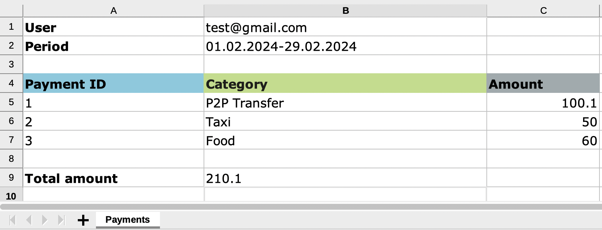

## Service for xlsx files generation.

### Source code for [Medium article](https://medium.com/@kostiantynillienko/golang-building-microservice-for-generating-xlsx-excel-reports-f0aaf8e47711).

### Stack:

* [Xlsx](https://github.com/tealeg/xlsx)
* [Fx](https://github.com/uber-go/fx)
* [Gin](https://github.com/gin-gonic/gin)
* [Swaggo](https://github.com/swaggo)
* [Testify](https://github.com/stretchr/testify)

### Request examples located in `test_data` folder.

### Commands:

#### Generate OpenAPI spec:

````shell
swag init --parseDependency
````

#### Docker build

````shell
docker build -t xlxs-generator:latest .
````

#### Docker run

````shell
docker run -d -t -i -p 8080:8080 --name xlxs-generator xlxs-generator:latest
````

### Generated file example:

